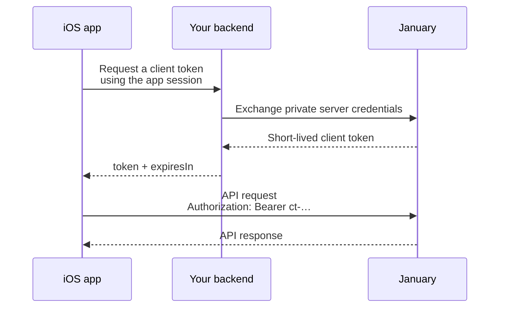

# Backend token endpoint

Public SDK authentication begins with a short-lived client token. Put January's private token-issuance integration behind your own authenticated backend.



## What your backend owns

Your backend must:

1. Authenticate the caller using your existing app session.
2. Derive the partner-owned user ID on the server; do not trust an arbitrary user ID from the device.
3. Complete the private server-side January token exchange.
4. Request a short-lived token scoped to that user.
5. Return the stable token response to the app.

```json
{
  "token": "ct-…",
  "expiresIn": 1800
}
```

The SDK's `JanuaryClientToken` decoder also accepts `expires_in` when your backend relays January's snake-case response unchanged.

The token is the authority for end-user identity on January requests. The iOS
app must not be able to exchange its session for a token belonging to another
user.

## Endpoint location is app configuration

January's SDK cannot know your backend host, path, HTTP method, or session-authentication mechanism. Inject that configuration into your `JanuaryTokenProvider`; the SDK intentionally provides no token-endpoint URL or fallback.

Fail during app configuration when the endpoint is absent. A fallback URL turns a clear startup problem into a confusing runtime or security failure.

## Security rules

* Never return server-side token-issuance credentials to the app.
* Never log server-side credentials or client tokens.
* Use HTTPS outside local simulator development.
* Authenticate and authorize every token request.
* Keep token responses out of analytics and crash-report breadcrumbs.
* Return a lifetime greater than 60 seconds; the SDK rejects already-expired or nearly expired credentials.

The endpoint implementation is partner-specific. The stable SDK boundary is the response body and the provider protocol, not a hard-coded URL.

Next, implement [Authentication](authentication.md) in the app.
